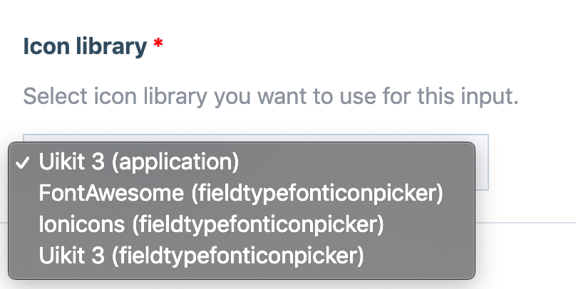
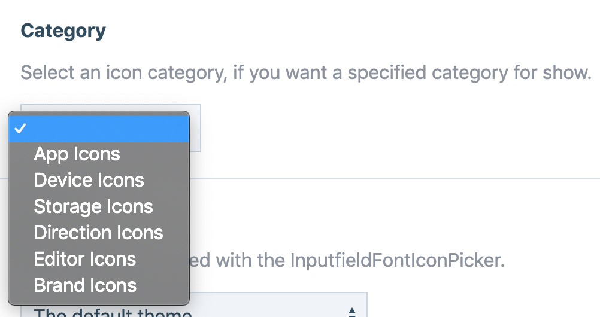
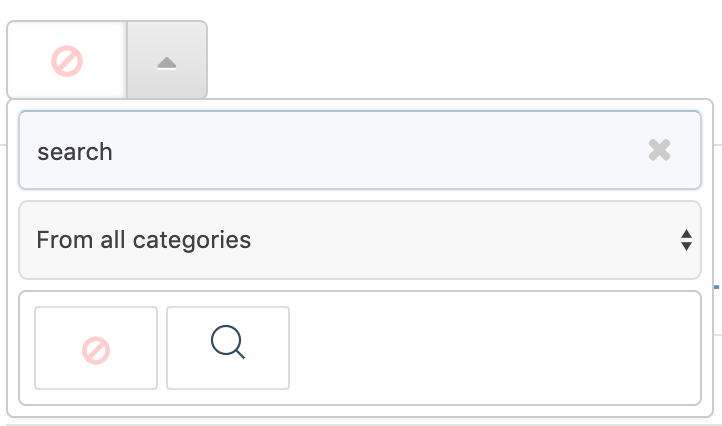
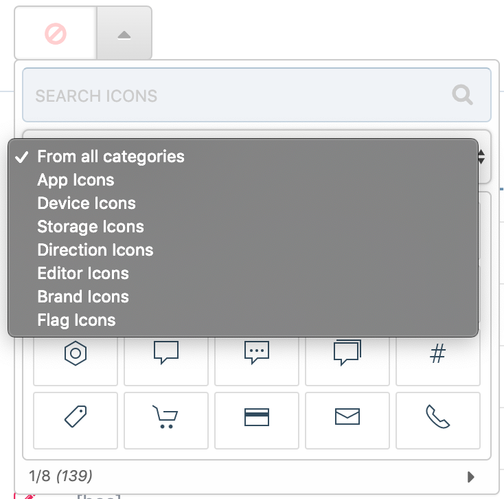

# FieldtypeFontIconPicker

> This field-type allow to you easily pick icons from input-field. This module using [jQuery fontIconPicker](https://github.com/fontIconPicker/fontIconPicker) as icon selector. You can see supported icon libraries below. If you need to use custom fonts you can check below example. 

### Supported Icon Libraries
- [FontAwesome 4.7.0](https://fontawesome.com/v4.7.0/icons/)
- [Uikit 3.0.34](https://getuikit.com/docs/icon#library)
- [IonicIcons 2.0.1](http://ionicons.com/)

### [Cahangelog](https://github.com/trk/FieldtypeFontIconPicker/blob/master/CHANGELOG.md)

---

**NOTE:** Module store data without prefix, you need to add **"prefix"** when you want to show your icon on front-end, because some of front-end frameworks using font-awesome with different **"prefix"**.

---

### Module will search `site/modules/**/configs/IconPicker.*.php` and `site/templates/IconPicker.*.php` paths for `FieldtypeFontIconPicker` config files.

All config files need to return a `PHP ARRAY` like examples. 

---

### **Example config file :** create your own icon set.

File location is `site/configs/IconPicker.example.php`

```php
<?php

namespace ProcessWire;

/**
 * IconPicker : Custom Icons
 */
return [
    "name" => "my-custom-icons",
    "title" => "My Custom Icon Set",
    "version" => "1.0.0",
    "styles" => array(
        wire("config")->urls->templates . "dist/css/my-custom-icons.css"
    ),
    "scripts" => array(
        wire("config")->urls->templates . "dist/js/my-custom-icons.js"
    ),
    "categorized" => true,
    "attributes" => array(),
    "icons" => array(
        "brand-icons" => array(
            "title" => "Brand Icons",
            "icons" => array(
                "google", "facebook", "twitter", "instagram"
            )
        ),
        "flag-icons" => array(
            "title" => "Flag Icons",
            "icons" => array(
                "tr", "gb", "us", "it", "de", "nl", "fr"
            )
        )
    )
];
```

### **Example config file :** use existing and extend it.

File location is `site/configs/IconPicker.altivebir.php`

```php
<?php

namespace ProcessWire;

/**
 * IconPicker : Existing & Extend
 */

$resource = include wire("config")->paths->siteModules . "FieldtypeFontIconPicker/configs/IconPicker.uikit.php";

$url = wire("config")->urls->templates . "dist";

$resource["scripts"] = array_merge($resource["scripts"], ["{$url}/js/Altivebir.Icon.min.js"]);

$resource["icons"]["flag-icons"] = [
    "title" => "Flag Icons",
    "icons" => array("tr", "en", "fr", "us", "it", "de")
];

$resource["icons"]["brand-icons"]["icons"] = array_merge($resource["icons"]["brand-icons"]["icons"], array(
    "altivebir"
));

return $resource;
```

After you add your custom config file, you will see your config file on library select box. `Library Title` `(Location Folder Name)`.



If your library categorized and if you have categorized icons set like `uikit` and `fontawesome` libraries, you will have category limitation options per icon field or leave it empty for allow all categories `(default)`.



---

### Example : `output`

```php
if ($icon = $page->get("iconField")) {
    echo "<i class='prefix-{$icon}' />";
}
```

### MarkupFontIconPicker Usage

```php
// MarkupFontIconPicker::render(YourIconField=string, Options=array)
echo MarkupFontIconPicker::render($page->YourIconField, [
        'prefix' => 'uk-icon-', // Icon class prefix, if you have different prefix, default is : "fa fa-"
        'tag' => 'span', // Icon tag default is : "i"
        'class' => 'fa-lg', // If you have extra cutom classes, for example : icons sizes, Array or Sting value
        'style' => 'your custom styles if you have' // Array or String Value
    ]);
```

## Theme support


## Search support


## Category support
